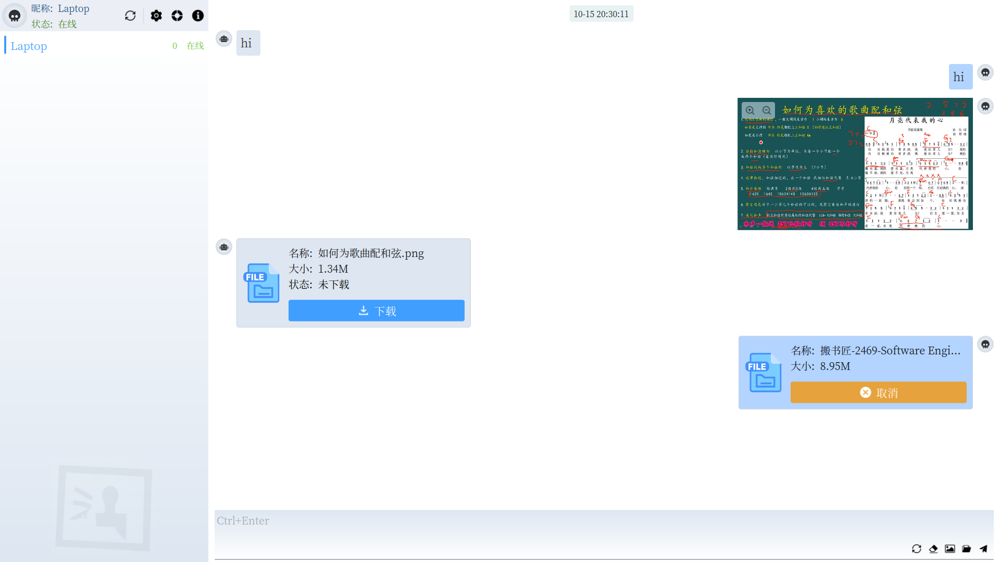

[English Document](./README.md)

#### 介绍
`p2p`内网聊天软件。程序使用`Slint-UI`和`Rust`编写。

#### 功能
- [x] 支持自动发现节点
- [x] 支持刷新列表
- [x] 支持中英界面
- [x] 支持发送文本
- [x] 支持发送图片
- [ ] 支持发送文件

#### 如何构建？
- 安装`Rust`和`Cargo`
- 执行`make build`
- [Makefile](./Makefile)了解更多

#### 参考
- [Slint Language Documentation](https://slint-ui.com/releases/1.0.0/docs/slint/)
- [github/slint-ui](https://github.com/slint-ui/slint)
- [Viewer for Slint](https://github.com/slint-ui/slint/tree/master/tools/viewer)
- [LSP (Language Server Protocol) Server for Slint](https://github.com/slint-ui/slint/tree/master/tools/lsp)
- [docs.libp2p.io](https://docs.libp2p.io/concepts/introduction/overview)
